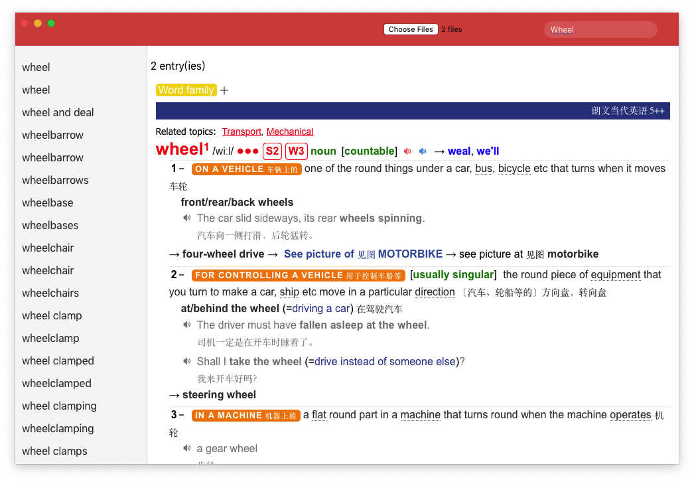

# mdictApp

### 项目说明

mdictApp 是一个基于 tauri 框架开发的跨平台软件，支持 mdict (_.mdx/_.mdd) 词典格式

### 项目截图



### 环境搭建

[Windows](https://tauri.studio/v1/guides/getting-started/prerequisites/#setting-up-windows)

[MacOs](https://tauri.studio/v1/guides/getting-started/prerequisites/#setting-up-macos)

### 构建应用

```bash
# 安装依赖
npm install

# 开发模式
npm run tauri dev

# 打包项目
npm run tauri build
```

### 赞助我

如果觉得这些内容不错，请我喝杯咖啡吧。


